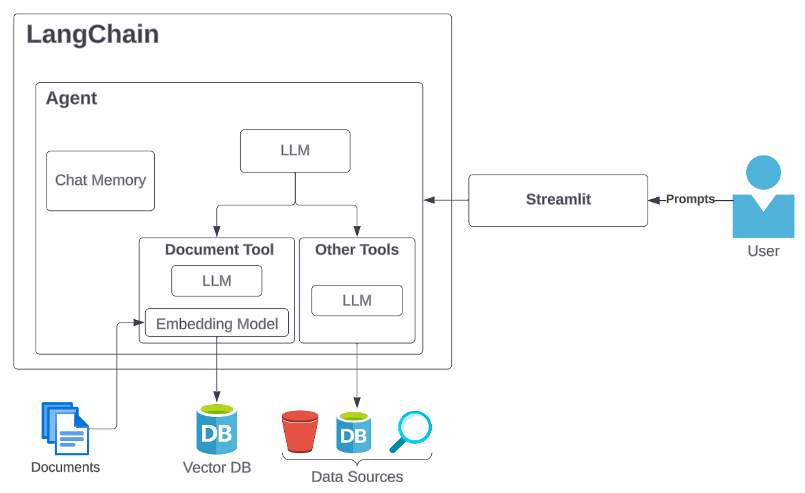

# GenAI Capstone Project (Presentation 2/16/24)

In this capstone project, you will be creating an AI Chatbot using Large Language Models (LLM) and Retrieval Augmented Generation (RAG) architecture. The project should be able to engage in conversations with users and answer questions about topics it did not encounter during its training by leveraging external data.

Project presentation is going to be on the last day of the training 2/16/24.

## Project Requirements

- Users should interact with a LangChain Chain or Agent, an LLM equipped with tools.
  - Tools should retrieve data and provide additional context to the Agent to answer the user's questions (e.g., retrieve data from documents, the web, databases, etc.).
- The Chains or Agents should maintain a memory of the ongoing chat.
- The project should utilize a vector database and an embedding model to enable semantic search.
- Some sort of interface.

## Technologies

The project will utilize the following technologies:

- Python
- LLM
- LangChain
- ChromaDB and an embedding model
- Various data sources (documents, databases, etc.)
- Streamlit

## Architecture Diagram

