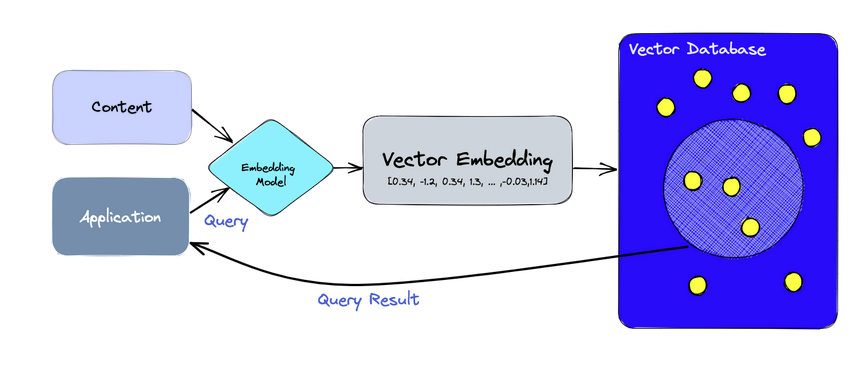
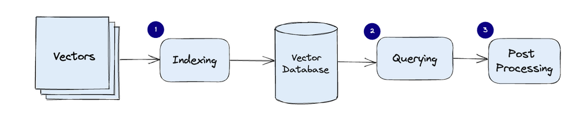

# Vector Database

## **What is a Vector Database?**

### 1. **Introduction to Vector Databases**

- **Definition**: A vector database is a specialized database designed for indexing, storing, and retrieving vector embeddings efficiently. It supports fast similarity searches and standard database operations (CRUD, metadata filtering, horizontal scaling).

### 2. **Context: The AI Revolution**

- **Importance in AI**: In the era of AI advancements, vector databases are pivotal for applications involving large language models, generative AI, and semantic search.
- **Role in Data Processing**: They address the growing need for efficient data processing in complex AI applications.

### 3. **Vector Embeddings: The Core of AI Applications**

- **What Are Vector Embeddings**: They are data representations carrying semantic information crucial for AI understanding and memory.
- **Generation and Complexity**: Created by AI models like Large Language Models, embeddings contain multiple attributes or features, making them complex to manage.
- **Importance in AI**: These features represent different data dimensions vital for understanding patterns, relationships, and structures in machine learning.

### 4. **The Need for Vector Databases**

- **Specialization**: Unlike traditional databases, vector databases like Pinecone are tailored to handle the complexities and scale of vector embeddings.
- **Advantages Over Scalar-Based Databases**: They combine traditional database capabilities with specialized handling of vector data, which scalar-based databases cannot efficiently manage.

### 5. **Challenges Addressed by Vector Databases**

- **Overcoming Limitations of Scalar Databases**: Scalar-based databases struggle with the complexity and scale of vector data.
- **Real-Time Analysis and Insights**: Vector databases facilitate extracting insights and performing real-time analysis on complex data.

### 6. **Benefits and Advanced Features**

- **Enhanced AI Capabilities**: They enable advanced AI features like semantic information retrieval and long-term memory.
- **Performance, Scalability, Flexibility**: Vector databases offer the necessary performance, scalability, and flexibility for maximizing data potential.

**Diagram Illustrating Vector Database Architecture:**

## **How Does a Vector Database Work?**

### 1. **Basic Comparison with Traditional Databases**

- **Traditional Databases**: Store data in rows and columns with scalar data types like strings and numbers.
- **Vector Databases**: Focus on storing and querying vectors, requiring a different optimization and query approach.

### 2. **Querying Mechanism: Similarity vs Exact Match**

- **Traditional Databases**: Queries usually search for rows with values exactly matching the query.
- **Vector Databases**: Queries are based on similarity metrics to find vectors most similar to the query.

### 3. **Core Functionality: Approximate Nearest Neighbor (ANN) Search**

- **ANN in Vector Databases**: Employ a variety of algorithms (hashing, quantization, graph-based search) for ANN search.
- **Purpose of ANN Algorithms**: These algorithms optimize the search process to quickly and accurately retrieve vectors that are nearest neighbors to a queried vector.

### 4. **Algorithmic Pipeline for Speed and Accuracy**

- **Assembled Pipeline**: A combination of algorithms is assembled into a pipeline to ensure efficient retrieval.
- **Trade-offs**: There's a balance between accuracy and speed. Higher accuracy can slow down the query.

### 5. **Accuracy vs. Speed: The Key Trade-Off**

- **Main Consideration**: Balancing accuracy with query speed.
- **Advanced Systems**: Well-designed vector databases can provide ultra-fast searches with near-perfect accuracy.

### 6. **Conclusion: A Different Approach to Data Retrieval**

- **Shift in Data Retrieval**: From exact match queries to similarity-based searches, using sophisticated algorithms to efficiently manage this new type of data.
- **Importance**: Crucial for applications needing to find the most similar items quickly in a large dataset, a common requirement in many modern AI-driven applications.

**Diagram of Vector Database Workflow:**

### **Details of the Vector Database Workflow**

#### 1. **Indexing**

- **Process**: Starts with a set of vectors, which are typically high-dimensional data points.
- **Indexing Method**: The vectors undergo indexing, organized for efficient similarity searches using various optimization algorithms.

#### 2. **Vector Database Structure**

- **Storage**: Once indexed, vectors are stored in the vector database.
- **Structure**: The database is designed to handle unique vector storage requirements, maintaining relationships between vector dimensions.

#### 3. **Querying Mechanism**

- **Query Process**: Searches for vectors most similar to the query vector.
- **Method**: Typically employs an Approximate Nearest Neighbor search algorithm, balancing speed and accuracy.

#### 4. **Post Processing**

- **Further Refinement**: After retrieving similar vectors, additional post-processing steps might be applied.
- **Integration**: These steps could include refining results, applying filters, or integrating results with other data or applications.
